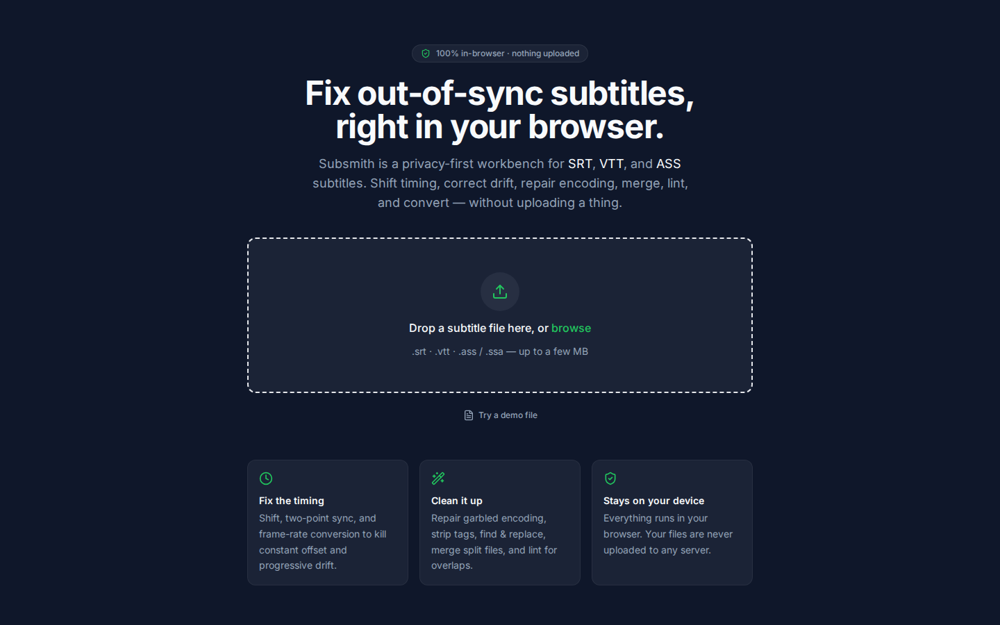
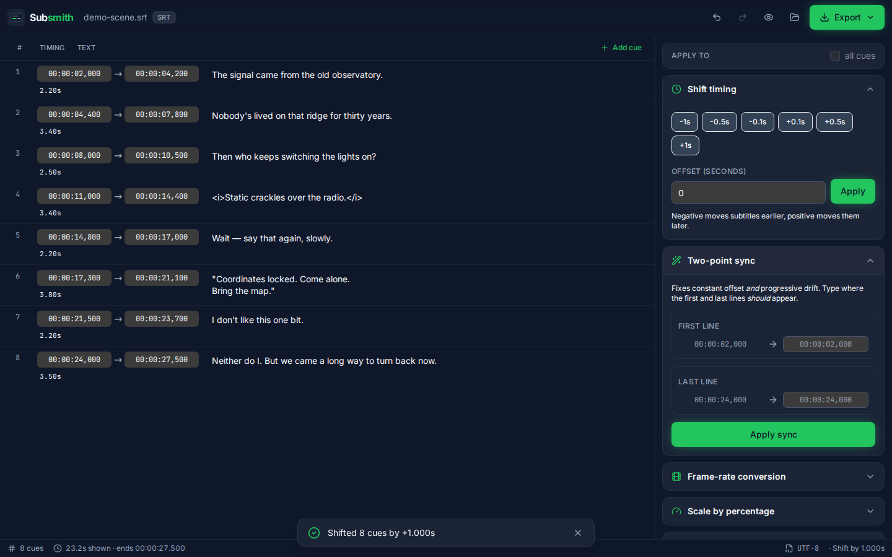
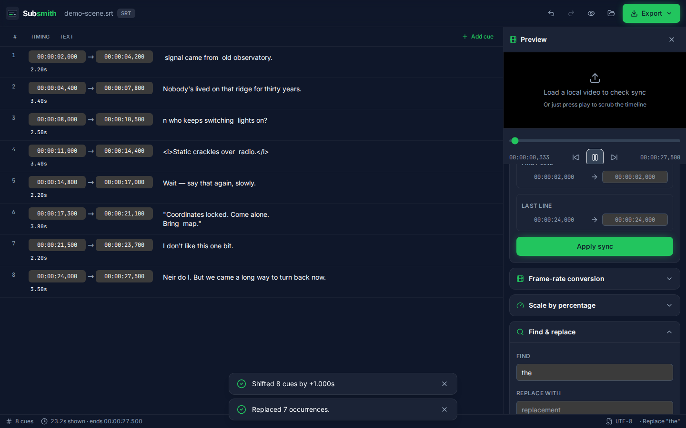
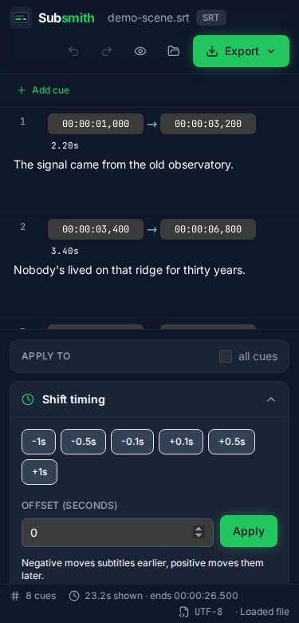

<div align="center">

# Subsmith

**A privacy-first subtitle workbench that runs entirely in your browser.**

Fix out-of-sync subtitles in seconds — shift timing, correct progressive drift with two-point
sync or frame-rate conversion, repair garbled encoding, find & replace, merge split files, lint
for problems, and convert between **SRT**, **WebVTT**, and **SubStation Alpha (ASS)**.
Nothing is uploaded. Everything happens on your device.



</div>

## Why Subsmith?

If you watch downloaded media (Plex, Jellyfin, Kodi, VLC…), learn a language with subtitles, or
do light fansubbing, you've hit this: the subtitles don't line up with the video.

- They start a few seconds early or late (**constant offset**).
- They slowly drift out of sync over a whole film because the subtitle was timed for a different
  frame rate — the classic **23.976 vs 25 fps / PAL↔NTSC** problem (up to ~7 seconds of drift in
  a 2-hour movie).
- The text is **garbled** (`é` instead of `é`) because of the wrong character encoding.
- You have **two files** (CD1/CD2) that need merging.
- Your player wants `.vtt` but you have `.srt` or `.ass`.

The powerful desktop tools are Windows-centric downloads, and the web tools each fix only **one**
of these. Subsmith does all of it in one polished page that works on macOS, Linux, Chromebook,
Windows, and mobile — with **nothing uploaded to any server**.

## Features

- **Load** `.srt`, `.vtt`, `.ass`/`.ssa` by drag-and-drop or file picker, with automatic format
  detection.
- **Encoding detection & repair** — auto-detects the text encoding (UTF-8/16, Windows-125x,
  ISO-8859-x, Big5, Shift_JIS, …), with a one-click manual override and a "fix mojibake" cleaner.
- **Shift** all or selected cues by any offset.
- **Two-point sync** — give the correct time for an early line and a late line; Subsmith solves
  the linear transform that fixes **constant offset *and* progressive drift** at once.
- **Frame-rate conversion** — presets (23.976→25, 25→23.976, 29.97→25, …) plus custom from/to fps.
- **Scale** timing by a percentage for fine corrections.
- **Find & replace** with regex (run safely off the main thread) and capture-group support.
- **Clean up** — strip formatting tags, trim whitespace, sort, remove empty cues.
- **Merge** a second subtitle file with an offset (combine CD1 + CD2).
- **Validate** — flags overlaps, negative/zero durations, out-of-order cues, too-short/long
  display times, and fast reading speed, with one-click fixes.
- **Live preview** — scrub a timeline and watch the active cue, or load a **local** video and see
  your edited subtitles rendered over it to verify the sync.
- **Export** to SRT, VTT, or ASS, with optional UTF-8 BOM.
- **Undo/redo**, multi-select, inline editing, and a fast virtualized list that stays smooth on
  files with thousands of cues.

| Editor | Preview | Mobile |
|---|---|---|
|  |  |  |

## Privacy

Subsmith is **100% client-side**. Your subtitle and video files never leave your browser — there
is no backend, no upload, no account, and no analytics. Fonts are self-hosted, so the app makes
**no third-party network requests** and works fully offline once loaded.

## Getting started

### Use it
Open the live app (linked from the repository's **About** / Releases), or run it locally:

```bash
git clone https://github.com/Skytuhua/subsmith.git
cd subsmith
npm install
npm run dev      # open the printed http://localhost:5173
```

### Build it
```bash
npm run build    # outputs a static site to dist/
npm run preview  # serve the production build locally
```
The contents of `dist/` are a static bundle — host them anywhere, or open them via a static server.

### Run from a release artifact
Download `subsmith-dist.zip` from the [latest release](https://github.com/Skytuhua/subsmith/releases),
unzip it, and serve the folder (e.g. `npx serve subsmith-dist`) or open it via any static server.

## Usage examples

**Fix a constant offset:** load your `.srt`, open **Shift timing**, type `-2.5` seconds (or use the
quick buttons), **Apply**, then **Export**.

**Fix progressive drift:** open **Two-point sync**, type where the **first** line and the **last**
line *should* appear (Subsmith shows their current times), **Apply sync**. Or, if you know the
frame rates, use **Frame-rate conversion** (e.g. `23.976 → 25`).

**Repair garbled text:** if a file looks wrong, change **Encoding** in the top bar (e.g. to
Windows-1251) to re-decode it, then export as UTF-8.

**Convert formats:** load an `.ass`, choose **WebVTT** in the Export menu, download.

## Scripts

| Command | What it does |
|---|---|
| `npm run dev` | Start the dev server |
| `npm run build` | Type-check and build the static site to `dist/` |
| `npm run preview` | Serve the built site |
| `npm test` / `npm run test:run` | Run the unit test suite (Vitest) |
| `npm run lint` | Lint with ESLint |
| `npm run format` | Format with Prettier |

## Tech

Vite + React + TypeScript + Tailwind CSS. Encoding detection via `jschardet`; cue-list
virtualization via `@tanstack/react-virtual`; icons from `lucide-react`. The subtitle engine
(parsers, serializers, timing math, lint) is a pure, framework-free, unit-tested core in
`src/core/`. See [`ARCHITECTURE.md`](ARCHITECTURE.md).

## Limitations

- **No automatic audio/AI sync** — by design (it would require server-side ML/ffmpeg and break the
  client-side guarantee). Subsmith focuses on fast, exact manual/two-point/frame-rate correction.
- Over-shifting into negative time is clamped to `00:00:00,000` on export (no subtitle format can
  store negative timestamps).
- Text-only formats — no image-based subtitles (PGS/VobSub) or OCR.

## Contributing

Issues and pull requests are welcome. Run `npm run lint && npm run test:run` before submitting.

## License

[MIT](LICENSE) © Skytuhua. Third-party dependency licenses are listed in
[`THIRD_PARTY_NOTICES.md`](THIRD_PARTY_NOTICES.md).
